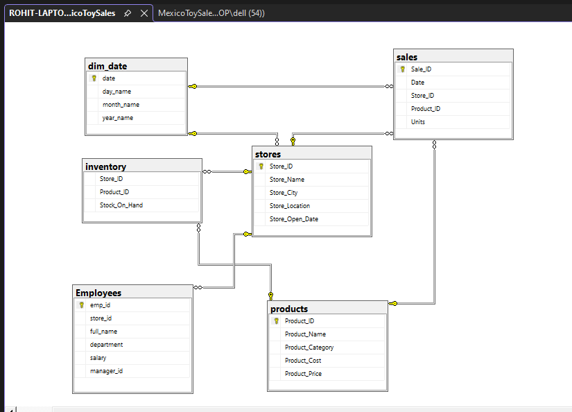
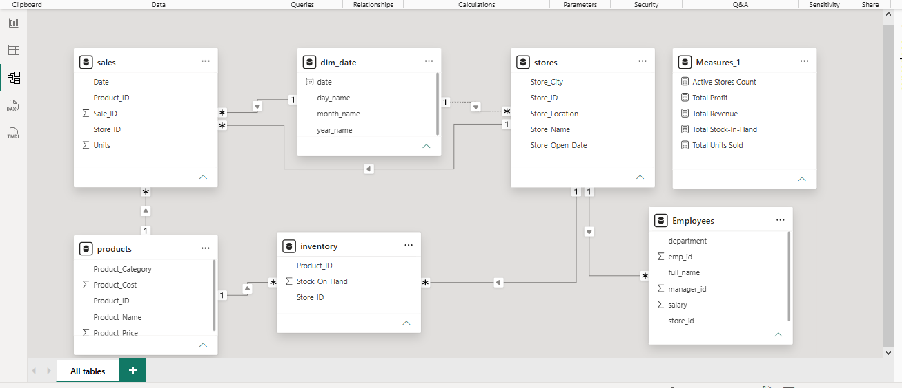
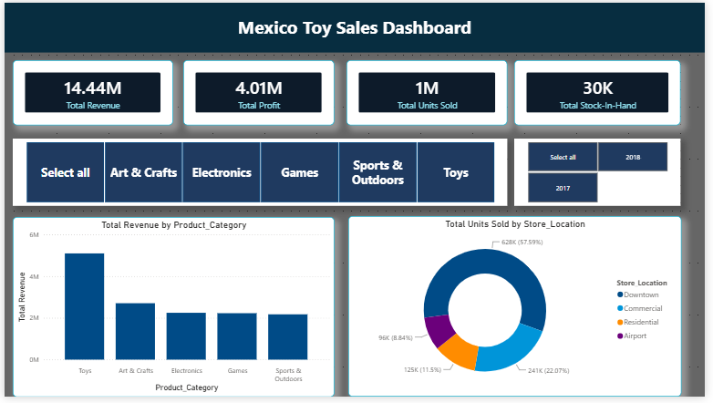

# Mexico Toy Sales Dashboard & Data Analysis

## 📊 Project Overview
End-to-end data analytics project examining sales performance, inventory stock levels, and profitability for a toy retailer in Mexico. The project covers data extraction, relational database design with SQL constraints, recursive date table generation, exploratory data analysis (EDA), and executive Power BI visualization.

---

## 🛠️ Tech Stack & Functions Used

| Tool / Technology | Key Features & Functions Used |
| :--- | :--- |
| **Excel** | `XLOOKUP`, `VLOOKUP`, Pivot Tables, Data Validation |
| **SQL (T-SQL)** | **DDL/DML**: `CREATE TABLE`, `ALTER TABLE`, `DROP`, `INSERT` **Functions & Operations**: CTEs, Recursive CTEs (`OPTION (MAXRECURSION)`), `LAG()`, `DENSE_RANK()`, `SUM()`, `ROUND()`, `CAST()`, `NULLIF()` **Relational Constraints**: Primary Keys (PK), Foreign Keys (FK) |
| **Power BI** | Star Schema Modeling, DAX Measures, Slicers (Tile Format), Mobile Layout Design |

---

## 🗄️ Database Schema & Relational Modeling
* Built a custom relational database (`MexicoToySales`) establishing integrity constraints across multiple tables.
* **Tables Created/Imported**: `sales`, `products`, `stores`, `inventory`, `employees`, and a custom-generated `dim_date` calendar table.
* **Keys Implemented**: Enforced primary keys and foreign key relationships connecting `sales` and `inventory` to `stores`, `products`, and `dim_date`.

---

## 🔍 Exploratory Data Analysis (SQL Queries)
The analysis answers critical business questions through advanced SQL queries:
1. **Sales by Product Category**: Used CTEs and conditional aggregations to evaluate year-over-year category growth performance.
2. **Revenue & Profit Margins**: Calculated annual revenue and profit metrics utilizing grouped aggregations and rounding functions.
3. **Store Performance Ranking**: Ranked store locations based on average order and unit sales volume using window functions like `DENSE_RANK()`.
4. **Monthly Seasonality Trends**: Tracked month-over-month revenue changes using the `LAG()` window function over periodic CTE structures.
5. **Stockout Risk Analysis**: Filtered high-volume items with low inventory thresholds over trailing 90-day activity periods.

---

## 📊 Key Power BI DAX Measures

| Measure Name | DAX Formula |
| :--- | :--- |
| **Active Stores Count** | `COUNTROWS(stores)` |
| **Total Profit** | `SUMX(sales, sales[Units] * (RELATED(products[Product_Price]) - RELATED(products[Product_Cost])))` |
| **Total Revenue** | `SUMX(sales, sales[Units] * RELATED(products[Product_Price]))` |
| **Total Stock-In-Hand** | `SUM(inventory[Stock_On_Hand])` |
| **Total Units Sold** | `SUM(sales[Units])` |

## 📈 Key Insights & Dashboard Preview
* **Total Revenue**: Reached $2.71M with strong structural profit margins across prime store locations.
* **Seasonality**: Sales volume spikes significantly during seasonal holiday windows, requiring tighter inventory buffers.
* **Top Categories**: Art & Crafts and standard Toys drive the highest transaction volumes across regional branches.

---

## 🖼️ Database & Model Schema Diagrams

### SQL Relational ER Diagram

### Power BI Relationship Schema

### Power BI Dashboard

